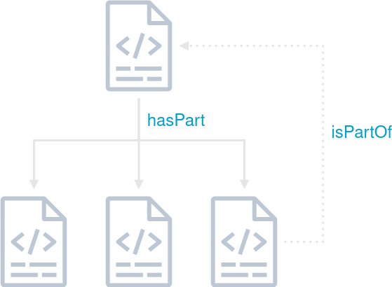

# Ideas / Discussions

During our participation in the Biohackathon Germany 2025, our working group engaged in extensive discussions focused on the practical and technical challenges of integrating RO-Crates in federated storage systems for life science data. The following sections present the central questions and ideas that emerged from these collaborative sessions. They reflect the real-world needs and obstacles faced by researchers and developers striving to advance FAIR data practices in distributed environments, and highlight areas where current standards and tooling may require further development.

---

## Handling RO-Crates with Extremely Large Datasets and Integrated Metadata

A recurring topic in our discussions was the management of RO-Crates that encapsulate extremely large datasets, particularly when the metadata file itself grows to an impractical size that becomes difficult to process and maintain, leading the group to identify the need for some form of pagination or segmentation.

<div style="padding: 25px; border: 2px dashed #00A0CC; border-radius: 4px; width: 90%; display: flex; flex-direction: column; justify-content: center; align-items: center">



**Fig. 1:** Schematic representation of a nested RO-Crate including a backwards pointing reference to the parent RO-Crate.

</div>

While the RO-Crate specification provides mechanisms for creating and referencing subcrates, a significant challenge arises in how these subcrates can reference their parent crates. Typically, subcrates are unaware of the existence of the top-level crate, which complicates hierarchical organization. One proposed solution was to utilize the `isPartOf` property to establish a link to the parent RO-Crate, although this property only allows referencing by `@id`. Addressing these limitations is essential for scalable metadata management in federated systems, and further work is needed to develop robust strategies for handling large, interconnected RO-Crate structures.

---

## Integrating Content Consistency Checks in File Metadata

Another important question was how to ensure content consistency and integrity within the file metadata of RO-Crates. The group discussed the desirability of including properties with each data entity that could be used to validate the integrity of the data entity's content. While creating a custom "data integrity profile" referenced in the `@context` section was considered, it was deemed too time-consuming to be prioritized as a high-priority task for the event. Instead, a more pragmatic approach was suggested by directly referencing established terms such as `Checksum`, `ChecksumAlgorithm`, and `checksumValue` from the SPDX vocabulary in the `@context` property of the RO-Crate, and applying these to each data entity. 

**Example:**
```json
[...]

  "@context": [
    "https://w3id.org/ro/crate/1.2/context",
      {
        "checksumAlgorithm": "https://spdx.org/rdf/terms/#checksumAlgorithm",
        "checksumValue": "https://spdx.org/rdf/terms/#checksumValue",
        "ChecksumAlgorithm": "https://spdx.org/rdf/terms/#ChecksumAlgorithm"
      }
  ],

[...]

    {
      "@id": "https://spdx.org/rdf/terms/#checksumAlgorithm_md5",
      "@type": "ChecksumAlgorithm",
      "name": "MD5",
      "description": "MD5 message-digest algorithm"
    },
    {
      "@id": "https://rocrate.s3.computational.bio.uni-giessen.de/file.txt",
      "@type": "File",
      "name": "file.txt",
      "description": "A sample text file in the root crate.",
      "encodingFormat": "text/plain",
      "contentSize": 5,
      "dateCreated": "2025-02-10",
      "checksumAlgorithm": {"@id": "https://spdx.org/rdf/terms/#checksumAlgorithm_md5"},
      "checksumValue": "a2e4822a98337283e39f7b60acf85ec9"
    },

[...]
```

The choice of checksum algorithm was also debated, with BLAKE3 and the ISCC technical innovation being suggested as potential candidates. A remaining challenge is how to efficiently update the checksum value when the content of a data entity changes, especially for large datasets. One proposed strategy was to recalculate everything when a change was triggered; however, as this solution represents a brute force approach, it was deemed suitable only for testing purposes rather than production use. This topic remains open for future investigation, as it is crucial for maintaining consistency and synchronization across interconnected RO-Crate structures in federated environments.

---

## Propagating Metadata Updates from Top-Level Crates to Referenced Subcrates

The question of how to propagate metadata updates from a top-level crate to its referenced subcrates was raised but not fully discussed to a final conclusion during the sessions. 

---

## Handling Property Conflicts in Nested RO-Crates

The primary applications of RO-Crate merging involve integrating distributed RO-Crates within federated systems for export purposes and enabling collaborative editing among multiple users. When independent RO-Crates are consolidated into a unified metadata document, access becomes more straightforward, yet this process alters the previously unambiguous assumptions regarding identity and provenance. Mainly the merging of separate crates introduces complications with conflicting assertions about identical entities, and relationships that span across crates. A properly merged crate must ensure that it still contains valid JSON-LD and eventually even enable that these transformations remain visible and understandable to users.

In the discussions we came up with a non-exhaustive rules to enforce during merging:
- Every described data entity must be reachable from the root via `hasPart`
- Ensure `@id` uniqueness; merge true duplicates, or mint new identifiers and record original ids as provenance
- Preserve differing property values by representing the property as an array and marking each value with its source
- tbc
