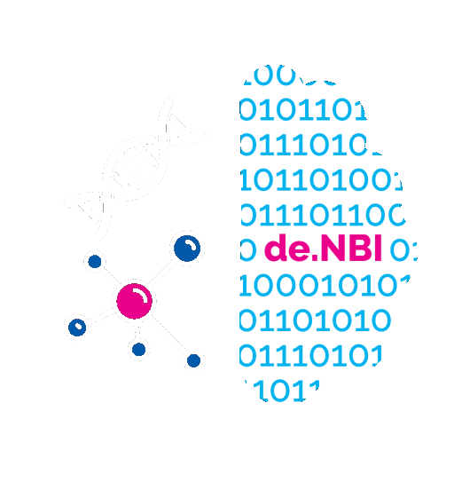

   

---

## Introduction

BioHackathon Germany is an annual event that brings together life scientists, bioinformaticians and data managers / data stewards from Germany and around the world. Organised by de.NBI & ELIXIR-DE, it offers an intense week of hacking with over 150 participants (on-site and online) working on diverse and exciting projects. The aim is to produce results that address challenges in bioinformatics and life science research. Scientists from companies are also encouraged to participate and submit project proposals connecting their work to open science activities and initiatives.

## Scope

BioHackathon Germany's activities are driven by dynamic sessions, where life scientists, bioinformaticians and data managers / data stewards meet, discuss and implement ideas and projects during intensive and productive hacking sessions. To be selected, projects need to demonstrate alignment with the research, infrastructure, training or RDM topics offered by de.NBI & ELIXIR Germany and its service centres.

## Goals

- Promote the development of an open source data integration infrastructure that will accelerate scientific innovation. This includes areas such as FAIR, identifiers, metadata standards, ontologies and metadata catalogues.

- Engage technical people from the bioinformatics community within and beyond de.NBI / ELIXIR-DE to collaborate on topics of common interest aligned with de.NBI / ELIXIR-DE activities.

- Strengthen and enable interactions and collaborations with ELIXIR, NFDI and other bioinformatics related projects through joint activities.

- Provide networking opportunities for all participating attendees
