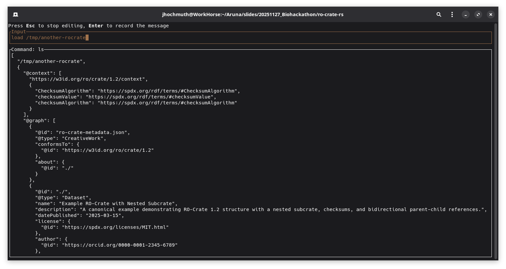
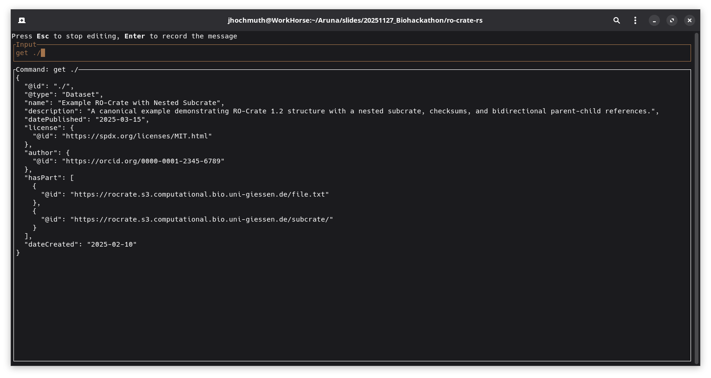
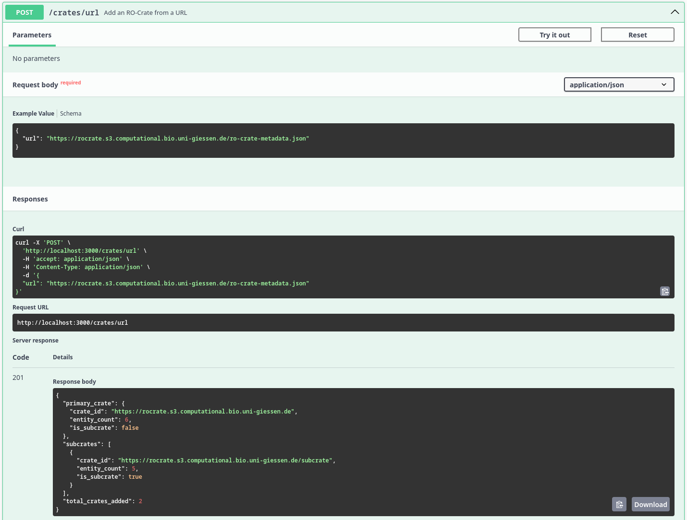
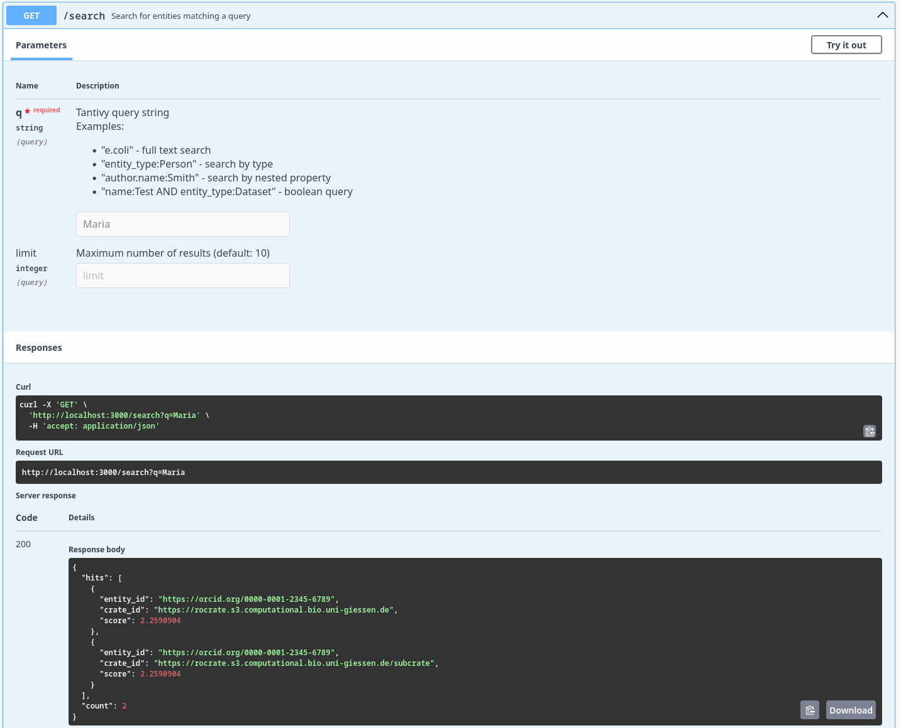
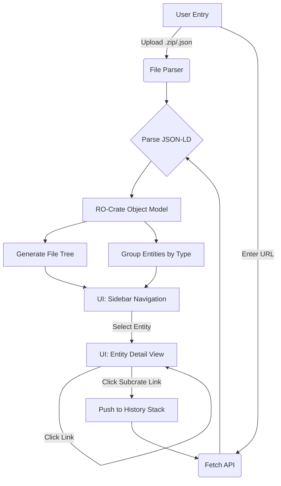

# Results

---

## Extensions to ro-crate-py

Extended the library with a class `Subcrate` extending the Dataset class. This additional implementation allows things like:

```python
main_crate = ROCrate("/tmp/ro-crate-dir")
subcrate = main_crate.get("subcrate")
subfile = subcrate.get("subfile.txt")
# or 
subfile = subcrate["hasPart"][0]
# or 
entities = subcrate.get_entities()
```

The implementation is such that the subcrate is only loaded when accessing some of its attribute, to avoid potentially loading large amount of metadata, as one purpose of the subcrate is also to reduce the amount of information in the main crate.

[🔗 **Link to the pull request with the feature implementations**](https://github.com/ResearchObject/ro-crate-py/pull/244)

---

## Extensions to ro-crate-rs

We added an interactive CLI mode for RO-Crate (attached and detached) exploration and traversal. This integrates the following commands:

```
Commands:
  load <url|path>    Load RO-Crate from URL or .zip file
  ls                 List hasPart of current dataset/folder
  ls -a              List all entities (data + contextual)
  get <@id>          Pretty-print JSON for entity
  cd <id>            Enter subcrate or folder
  cd ..              Return to parent
  cd /               Return to root crate
  pwd                Print current path
  help               Show this message

Supported formats:
  - .zip archives containing ro-crate-metadata.json
  - Direct URLs to RO-Crate archives
  - DOIs resolving to Zenodo/similar repositories
```

<div style="margin-bottom: 25px; display: flex; flex-direction: column; justify-content: center; align-items: center; border: 1px dashed #00A0CC;">



_Screenshot which shows the complete loaded top-level RO-Crate metadata file_
</div>

<div style="display: flex; flex-direction: column; justify-content: center; align-items: center; border: 1px dashed #00A0CC;">



_Screenshot which displays a specific entity after executing the `get ./` command_ 
</div>

During the development process, discussions were held with one of the official RO-Crate specification maintainers regarding the potential transfer of the library into the official ResearchObject Github organization. This conversation explored the benefits of housing the library within the established organizational structure, which would provide greater visibility within the RO-Crate community and signal its alignment with official specification standards. Future discussions with the current maintainer will focus on establishing joint development and shared maintenance of the library.

---

## RO-Crate indexing for easier exploration

The [**rocrate-indexer**](https://github.com/arunaengine/rocrate-indexer) tool implements a thin webserver that provides the following endpoints:

```
[POST]   /crates/url                Add an RO-Crate from a URL to the index
[POST]   /crates/upload             Add an RO- to the index by uploading a file (zip archive or ro-crate-metadata.json)

[GET]    /crates                    List information of all indexed RO-Crates 
[GET]    /crates/{crate-id}         Get full metadata of the RO-Crate associated with the specific id
[GET]    /crates/{crate-id}/info    Get shortened information (name, description, ancestry path) of the RO-Crate associated with the specific id
[GET]    /search                    Search for entities matching a query

[DELETE] /crates/{crate-id}         Delete RO-Crate associated with the specific id from the index
```

The tool also integrates a fulltext search index over all included entities of an RO-Crate metadata file. The search functionality can be performed either as a fuzzy search without a cleanly defined scope or as an exact search on specific fields of entities.

**Examples for search queries:**
  - Full text search: "e.coli"
  - Search by tpye: "entity_type:Person"
  - Search by nested property: "author.name:Smith"
  - Boolean query: "name:Test AND entity_type:Dataset"


<div style="margin-bottom: 25px; padding:15px; display: flex; flex-direction: column; justify-content: center; align-items: center; border: 1px dashed #00A0CC;">



_Screenshot which displays the result of the `/crates/url` endpoint after recursively ingesting the RO-Crate metadata files_ 
</div>

<div style="padding:15px; display: flex; flex-direction: column; justify-content: center; align-items: center; border: 1px dashed #00A0CC;">



_Screenshot which displays the result of the `/search` endpoint after searching for the query `Maria`_ 
</div>

---

## Demonstrator

The [**RO-Crate Explorer**](https://github.com/arunaengine/RO-Crate-Explorer) is a lightweight "Minimum Viable Product" (MVP) web application designed to demonstrate the parsing, visualization, and traversal of Research Object Crates (RO-Crates). It provides a user-friendly interface to navigate the complex graph structures of metadata, supporting both detached (remote) and local nested crate structures.

### Core Capabilities

#### 1. Universal Input Methods
The application serves as a flexible entry point for RO-Crate data, supporting three distinct loading mechanisms:

* **Remote URL:** Users can input a URL pointing to a remote crate or a specific `ro-crate-metadata.json` file. This allows for the exploration of detached crates hosted on external servers.
* **ZIP Archive:** Users can upload a zipped RO-Crate. The application utilizes `JSZip` to unpack the archive in memory and locate the metadata file automatically.
* **JSON Metadata:** Users can upload a raw `ro-crate-metadata.json` file directly for immediate parsing.

#### 2. File Tree & Graph Traversal
Once a crate is loaded, the application constructs a navigable representation of the data:

* **File Tree:** The sidebar displays a hierarchical tree view of the crate's content (Datasets and Files). This is computed by traversing the graph starting from the Root Dataset, handling parent-child relationships via the `hasPart` property.
* **Nested Crate Support:** The application is capable of detecting links to other RO-Crates. If an entity links to another `ro-crate-metadata.json`, the interface provides a dedicated **"Explore Subcrate"** button. Clicking this pushes the current state to a history stack and loads the new crate context, allowing users to "dive" deep into nested structures.

#### 3. Context & Filtering
Beyond the directory structure, RO-Crates contain rich contextual entities (e.g., `Person`, `Organization`, `CreativeWork`).

* **Context Filter:** The sidebar acts as a filter, grouping all non-file entities by their `@type`.
* **Graph Access:** This allows users to quickly locate specific metadata entities that do not appear in the physical file hierarchy but are crucial to the graph.

#### 4. Entity Inspection & Preview
Clicking any item in the tree or context menu opens the **Entity Viewer**:

* **Property Preview:** Displays all JSON-LD properties associated with the entity (e.g., `author`, `datePublished`, `description`).
* **Link Navigation:** Properties that link to other entities (by `@id`) are clickable, allowing the user to jump between connected nodes in the graph.
* **Raw Data:** A "Raw JSON" option is available to inspect the underlying JSON-LD source for debugging purposes.

### Process Flow

The following diagram illustrates how the Demonstrator processes user input and navigates the crate graph.



### Interface Overview

#### Dashboard State

_Placeholder_ for screenshot: Initial state showing the Dropzone and URL input field.

The entry screen allows for dragging and dropping files or pasting a remote URL to initialize the session.

#### Explorer State

_Placeholder_ for screenshot: Split-pane view with Sidebar (left) and Entity Details (right).

1. **Header**: Displays the current Crate name and Breadcrumb navigation history.
2. **Sidebar (Files)**: A collapsible tree structure representing the physical file organization.
3. **Sidebar (Context)**: A list of non-file entities (e.g., ContextEntity, Person) grouped by type.
4. **Main Content**: The detailed view of the currently selected entity, showing key-value pairs of metadata.

#### Nested Navigation

_Placeholder_ for screenshot: Detail view showing the "Explore Subcrate" button.

When the viewer encounters a property linking to another Metadata file, it renders an action button to seamlessly transition the application context to that sub-crate.