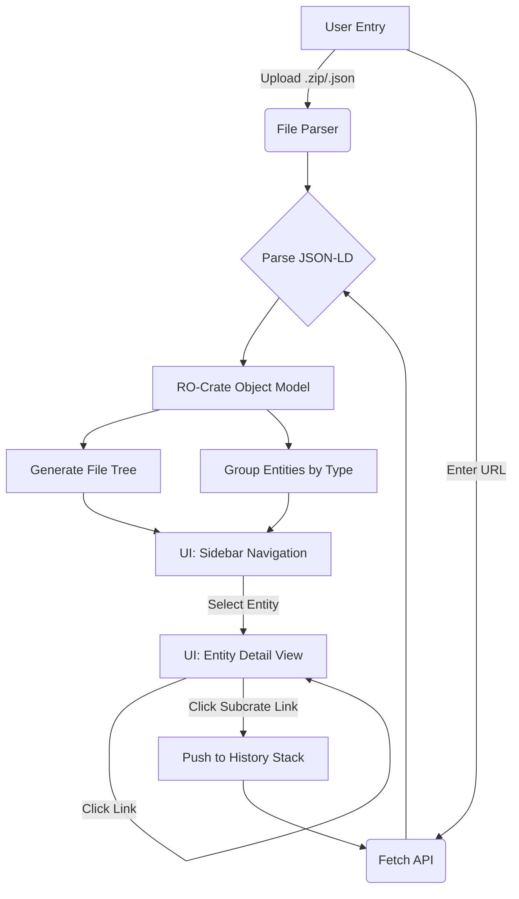
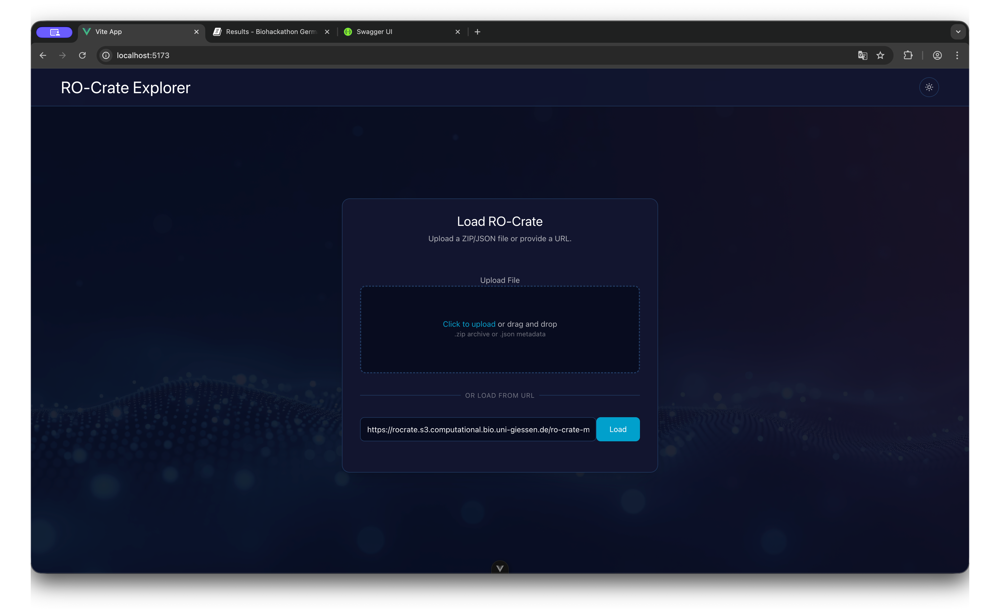
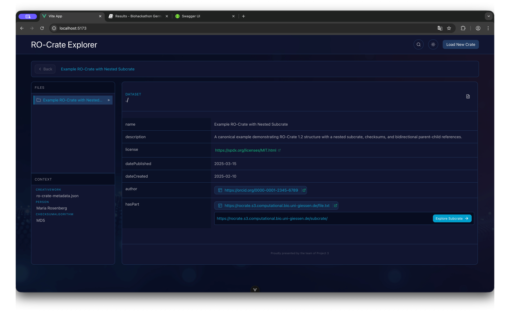
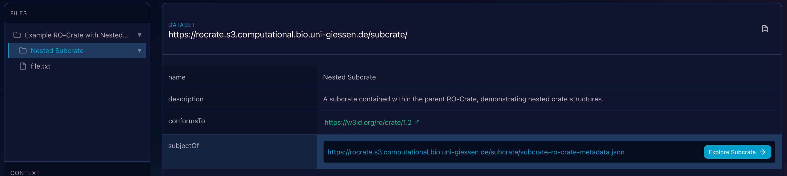
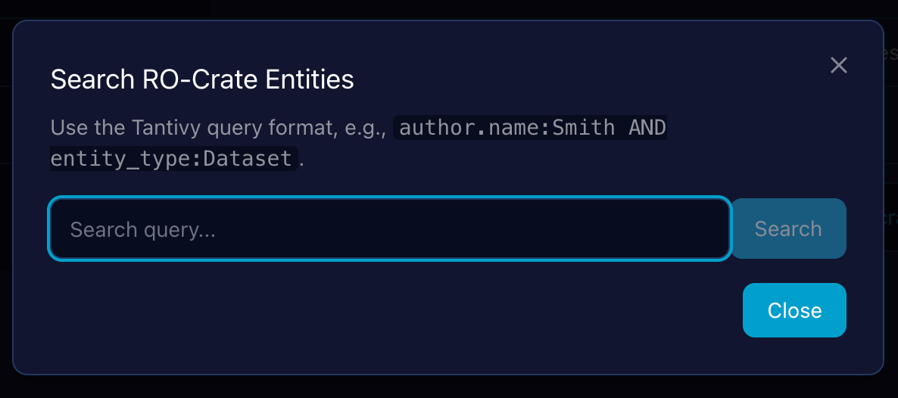
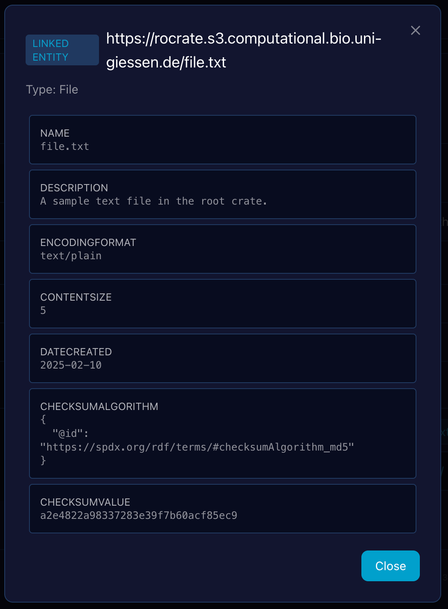
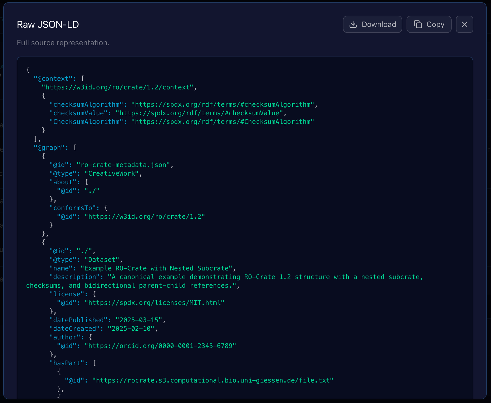

# Results

---

## Extensions to ro-crate-py

```
[...] traversing the graph from the top crate to a subcrate, as suggested in the 1.2 spec.

I am proposing a simple approach here, with a new Subcrate class extending the Dataset class.
I defined this class in the main rocrate.py file, in models.py it would cause circular dependencies.

This would allow things like

main_crate = ROCrate(test_data_dir / "crate_with_subcrate")
subcrate = main_crate.get("subcrate")
subfile = subcrate.get("subfile.txt")
# or 
subfile = subcrate["hasPart"][0]

(see added tests too)

at this point I am mostly interested to know if you think that could be a viable approach before going further.

The implementation is such that the subcrate is only loaded when accessing some of its attribute, to avoid potentially loading large amount of metadata, as one purpose of the subcrate is also to reduce the amount of information in the main crate.
```

[Link to the pull request with the feature implementations](https://github.com/ResearchObject/ro-crate-py/pull/244)

---

## Extensions to ro-crate-rs

- Interactive CLI mode for RO-Crate (attached and detached) exploration and traversal


- Fulltext search index over all included entities of a RO-Crate metadata file

**Screenshot Sebastian**


- Discussion with one of the official RO-Crate specification maintainers to move the library into the official `ResearchObject` Github organization


---

## Demonstrator

The **RO-Crate Explorer** is a lightweight "Minimum Viable Product" (MVP) web application designed to demonstrate the parsing, visualization, and traversal of Research Object Crates (RO-Crates). It provides a user-friendly interface to navigate the complex graph structures of metadata, supporting both detached (remote) and local nested crate structures.

### Core Capabilities

#### 1. Universal Input Methods
The application serves as a flexible entry point for RO-Crate data, supporting three distinct loading mechanisms:

* **Remote URL:** Users can input a URL pointing to a remote crate or a specific `ro-crate-metadata.json` file. This allows for the exploration of detached crates hosted on external servers.
* **ZIP Archive:** Users can upload a zipped RO-Crate. The application utilizes `JSZip` to unpack the archive in memory and locate the metadata file automatically.
* **JSON Metadata:** Users can upload a raw `ro-crate-metadata.json` file directly for immediate parsing.

#### 2. File Tree & Graph Traversal
Once a crate is loaded, the application constructs a navigable representation of the data:

* **File Tree:** The sidebar displays a hierarchical tree view of the crate's content (Datasets and Files). This is computed by traversing the graph starting from the Root Dataset, handling parent-child relationships via the `hasPart` property.
* **Nested Crate Support:** The application is capable of detecting links to other RO-Crates. If an entity links to another `ro-crate-metadata.json`, the interface provides a dedicated **"Explore Subcrate"** button. Clicking this pushes the current state to a history stack and loads the new crate context, allowing users to "dive" deep into nested structures.

#### 3. Context & Filtering
Beyond the directory structure, RO-Crates contain rich contextual entities (e.g., `Person`, `Organization`, `CreativeWork`).

* **Context Filter:** The sidebar acts as a filter, grouping all non-file entities by their `@type`.
* **Graph Access:** This allows users to quickly locate specific metadata entities that do not appear in the physical file hierarchy but are crucial to the graph.

#### 4. Entity Inspection & Preview
Clicking any item in the tree or context menu opens the **Entity Viewer**:

* **Property Preview:** Displays all JSON-LD properties associated with the entity (e.g., `author`, `datePublished`, `description`).
* **Link Navigation:** Properties that link to other entities (by `@id`) are clickable, allowing the user to jump between connected nodes in the graph.
* **Raw Data:** A "Raw JSON" option is available to inspect the underlying JSON-LD source for debugging purposes.

### Process Flow

The following diagram illustrates how the Demonstrator processes user input and navigates the crate graph.



### Interface Overview

#### Dashboard State



The entry screen allows for dragging and dropping files or pasting a remote URL to initialize the session.

#### Explorer State



1. **Header**: Displays the current Crate name and Breadcrumb navigation history.
2. **Sidebar (Files)**: A collapsible tree structure representing the physical file organization.
3. **Sidebar (Context)**: A list of non-file entities (e.g., ContextEntity, Person) grouped by type.
4. **Main Content**: The detailed view of the currently selected entity, showing key-value pairs of metadata.

#### Nested Navigation



When the viewer encounters a property linking to another Metadata file, it renders an action button to seamlessly transition the application context to that sub-crate.

#### Full-Text Search in RO-Crate Explorer



In addition to traversal, the Demonstrator provides a full-text search capability that indexes all metadata across the
loaded crate, allowing users to quickly find entities by matching terms in their properties (e.g., name, description, author).

#### Linked Entity Inspection as an Overlay



To maintain context during exploration, clicking on an entity link (an @id reference) within the main Entity Detail View 
triggers an overlay window rather than navigating away. This allows users to quickly inspect the metadata of a linked entity (e.g., an author or a datePublished entity) without losing the context of the parent entity they were initially viewing.

#### Raw JSON-LD Source Overlay and Export Actions



Clicking the "Raw JSON" option within the Entity Viewer (4) opens a modal overlay that displays the entity's complete, unparsed JSON-LD source code. 
This feature is crucial for debugging, schema validation, and verifying the exact structure of the data as it appears in the ro-crate-metadata.json file.

- **Lightweight Syntax Highlighting**: The raw JSON-LD is rendered with basic syntax highlighting to significantly improve readability and help users quickly parse the structure of keys, strings, and values.
- **Debug and Validation**: This view offers an immediate, faithful representation of the data, allowing users to confirm the properties and values being loaded by the application's internal object model.

To facilitate working with this raw data outside the application, the overlay is equipped with two export actions:

##### 1. Copy to Clipboard

A prominent "Copy" button is included within the overlay.

Functionality: Clicking this button instantly copies the entire, raw JSON-LD source text from the overlay to the user's clipboard, 
ready to be pasted into a text editor, debugger, or other tool.

##### 2. Download Entity Data

A "Download" button is provided to save the crate's metadata locally.

Format: The downloaded file contains the complete, raw entity metadata as a standard JSON-LD fragment.

These export functions ensure that developers and users can easily access and manipulate the exact metadata harvested by the RO-Crate Explorer.